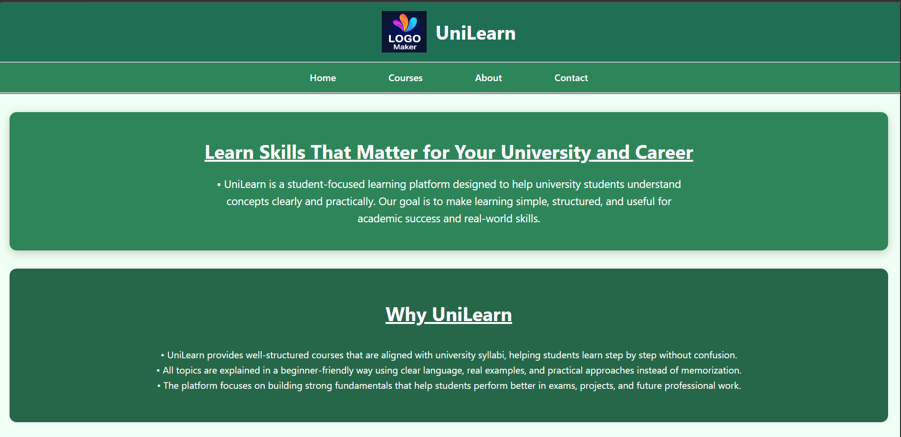

Perfect! I’ll integrate your **local image path** into the README and format it properly for GitHub. Here’s the updated version:

---

# UniLearn - Student Portal



**UniLearn** is a simple web-based student portal built as a practice project to learn HTML and CSS. This project demonstrates creating a structured, responsive, and visually appealing interface with card-style sections.

---

## Project Overview

This project was created in three steps:

1. **HTML Practice**

   * Learned the basics of structuring web pages using semantic HTML elements (`header`, `nav`, `main`, `section`, `footer`).

2. **CSS Practice**

   * Styled the HTML pages with CSS, including colors, fonts, spacing, card layouts, and hover effects.
   * Used flexbox for card layouts and alignment.

3. **Project: Student Portal**

   * Built a multi-section homepage featuring:

     * **Hero Section:** Introduction to UniLearn.
     * **Features Section:** Highlights of the platform using card-style design.
     * **Navigation Bar:** Links to Home, Courses, About, and Contact pages.
     * **Footer:** Basic copyright information.

---

## Features

* Responsive card-style layout for content sections.
* Sticky navigation bar for easy navigation.
* Hover effects on cards for improved interactivity.
* Consistent color scheme with green-themed cards and backgrounds.
* Semantic HTML structure for accessibility and SEO.

---

## Technologies Used

* HTML5
* CSS3 (including Flexbox, Box Shadows, Border Radius)

---

## Project Structure

```
/UniLearn-Student-Portal
│
├── index.html          # Home page
├── courses.html        # Courses page
├── about.html          # About page
├── contact.html        # Contact page
├── style1.css          # CSS for Home page
├── style2.css          # CSS for Courses and other pages
└── assets/
    └── logo.png        # Project logo
```
## How to Run

1. Clone the repository:

```bash
git clone https://github.com/yourusername/UniLearn-Student-Portal.git
```

2. Open `index.html` in your browser to view the homepage.

---

## License

This project is for **educational purposes** and personal practice.


